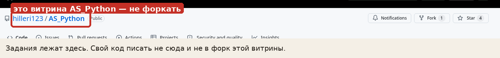
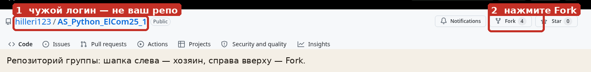
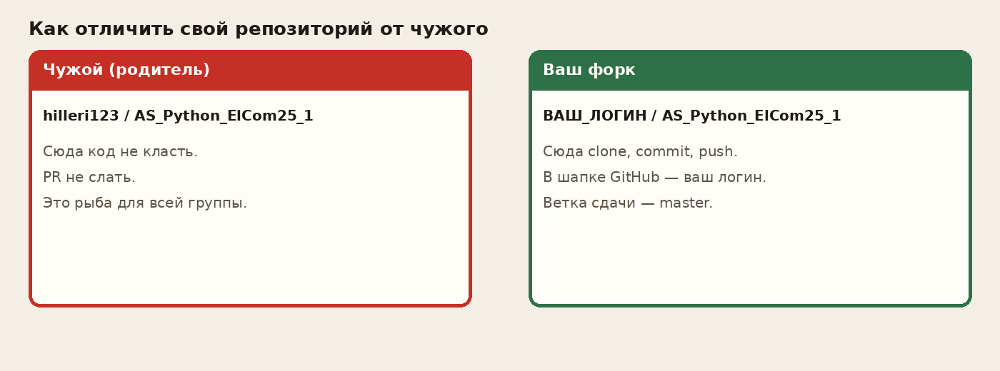
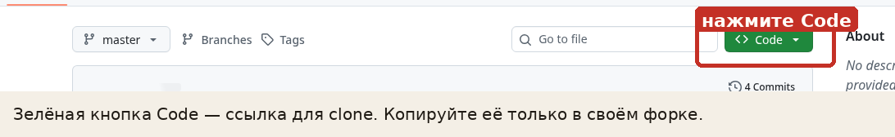
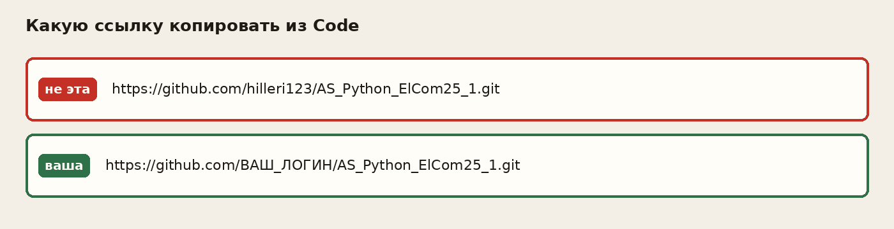

# Памятка: git и форк

Коротко: вы работаете **в своей копии** репозитория группы. Родительский репозиторий и витрину курса не трогаете.

Нужен аккаунт на [GitHub](https://github.com). Если его нет — сначала «Sign up».

## 1. Какой репозиторий форкать

Форк — **репозиторий своей группы**, не витрина.

| Группа | Что открыть |
|---|---|
| ЭлКом25-1 | [AS_Python_ElCom25_1](https://github.com/hilleri123/AS_Python_ElCom25_1) |
| ЭлКом25-2 | [AS_Python_ElCom25_2](https://github.com/hilleri123/AS_Python_ElCom25_2) |
| ЭлКом25-3 | [AS_Python_ElCom25_3](https://github.com/hilleri123/AS_Python_ElCom25_3) |

Витрина [AS_Python](https://github.com/hilleri123/AS_Python) — задания и лекции. Её **не форкать** и свой код туда не класть.



## 2. Сделать форк

1. Откройте репозиторий **своей** группы (таблица выше).
2. Справа вверху нажмите **Fork**.
3. В диалоге оставьте себя владельцем, подтвердите Create fork.



После этого у вас появится копия вида `ваш_логин/AS_Python_ElCom25_N`. Дальше работаете только в ней.

## 3. Свой репозиторий или чужой

Смотрите **шапку** страницы: `логин / имя_репо`.

- стоит `hilleri123` — это родитель или витрина, не ваше;
- стоит **ваш** логин GitHub — это форк, сюда можно писать.



То же в ссылке: после `github.com/` должен быть ваш логин, не `hilleri123`.

## 4. Склонировать свой форк

На странице **своего** форка нажмите зелёную **Code**, скопируйте HTTPS (или SSH, если уже настроено).



Какую строку копировать:



На компьютере:

```bash
git clone https://github.com/ВАШ_ЛОГИН/AS_Python_ElCom25_1.git
cd AS_Python_ElCom25_1
```

Подставьте свой логин и номер группы (`_1`, `_2` или `_3`).

Проверка, что remote смотрит на вас, а не на преподавателя:

```bash
git remote -v
```

Должно быть `.../ВАШ_ЛОГИН/AS_Python_ElCom25_N.git`. Если видите `hilleri123` — клонировали не то. Удалите папку и клонируйте форк заново.

## 5. Обычный цикл работы

Ветка сдачи — **`master`**. Новую ветку заводить не нужно.

```bash
# поправили файлы
git add 1lab/main.py student.json
git status
git commit -m "Лабораторная 1"
git push origin master
```

`git status` — что изменилось. `git add` — что войдёт в коммит. `git commit` — снимок у вас. `git push` — снимок на GitHub, в **ваш** форк.

Задания читайте в витрине. В форк их копировать не надо.

## 6. Чего не делать

- форк витрины `AS_Python`;
- `git clone` родителя `hilleri123/...` вместо своего форка;
- pull request в родительский репозиторий группы — он не нужен;
- коммитить `.env` — работу не смотрят, ломает проверку;
- коммитить `venv`.

## 7. Если что-то пошло не так

| Симптом | Что сделать |
|---|---|
| В шапке `hilleri123` | вы не в своём форке; откройте свой аккаунт → Repositories |
| `git push` пишет про доступ | remote указывает на чужой репо, или вы не вошли в GitHub |
| Форкнули не ту группу | сделайте форк нужного `ElCom25_N`, работу перенесите туда |
| Нет кнопки Fork | вы не вошли в GitHub |

Правила сдачи и защита — в [ORGANIZATION.md](ORGANIZATION.md).
