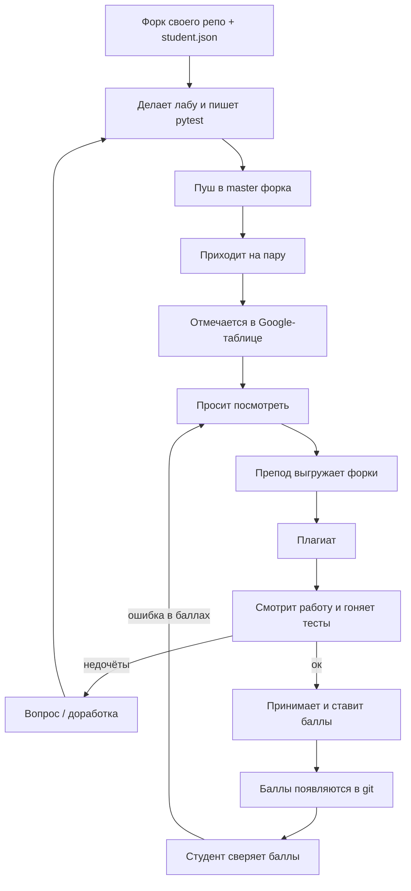

# Организация курса

Документ для преподавателя и для студентов. Скриптов проверки здесь нет: их и веб-интерфейс подключим отдельно, студенческие репозитории от этого не меняются.

## Четыре репозитория

| Репозиторий | Роль | Кто пишет |
|---|---|---|
| [hilleri123/AS_Python](https://github.com/hilleri123/AS_Python) | витрина: задания, БРС, лекции, эта схема | преподаватель |
| [hilleri123/AS_Python_ElCom25_1](https://github.com/hilleri123/AS_Python_ElCom25_1) | рыба для группы ЭлКом25-1 | студент в **своём форке** |
| [hilleri123/AS_Python_ElCom25_2](https://github.com/hilleri123/AS_Python_ElCom25_2) | то же для ЭлКом25-2 | студент в своём форке |
| [hilleri123/AS_Python_ElCom25_3](https://github.com/hilleri123/AS_Python_ElCom25_3) | то же для ЭлКом25-3 | студент в своём форке |

Родительские `ElCom25_*` не принимают студенческий код. Туда кладётся только общая рыба (`student.json`, `Nlab/main.py`, `Nlab/test_main.py`, README).

Форк **базового** `AS_Python` не нужен и не проверяется.

Синтаксис смотрите сами: [курс Stepik](https://stepik.org/course/100707/promo).

## Посещаемость

Студент отмечает себя сам в [таблице](https://docs.google.com/spreadsheets/d/1ZNWjld_zW6jlusZ-l1d5UQWeeBlzELPQYvSDdUAiWmo/edit?gid=671940646#gid=671940646), лист своей группы (ЭлКом25-1 / 2 / 3).

Пришли на пару — нашли строку — отметка в колонке даты. Не отметился — для учёта пары вас не было.

## Что делает студент

1. Открывает репозиторий своей группы и нажимает Fork. Работа идёт в форке, ветка **`master`**.
2. Клонирует **свой** форк, не родительский репозиторий.
3. Заполняет `student.json` (поля ниже). Вариант: `(номер зачётной книжки % 4) + 1`.
4. Пишет лабораторные и **свои тесты** в `1lab/` … `4lab/`. Точка входа — `main.py`, тесты — `test_main.py`.
5. Проверяет у себя из **корня** репозитория:

   ```bash
   python3 1lab/main.py
   pytest
   ```

   Без своих тестов и при падающем `pytest` лабораторная не принимается.
6. Зависимости дописывает в `requirements.txt` (`pytest` уже указан).
7. Коммитит и пушит в `master` своего форка. Pull request в родительский репозиторий не нужен.
8. На паре отмечается в таблице и просит преподавателя посмотреть работу.

Тексты заданий читает в базовом репозитории, не копирует их к себе.

## Схема приёма



Защита персональная: баллы ставятся при студенте. Потом они появляются в git — студент сверяет; если ошибка, говорит сразу.

Дорабатывать можно, пока семестр открыт, если работу не аннулировали за плагиат.

## Что делает преподаватель

Пока без скриптов и веба, вручную или через GitHub:

1. У каждого из трёх родительских репозиториев открыть список форков (`Insights → Forks` или API `/repos/hilleri123/AS_Python_ElCom25_N/forks`).
2. Скачать форк (clone). Имя папки удобно брать из логина GitHub.
3. В корне форка должен быть валидный `student.json`.
4. Запуск: `python3 Nlab/main.py` и `pytest`.
5. Проверка на плагиат. При недочётах — вопрос студенту или доработка. Если всё ок — баллы при студенте, затем выгрузка в git.

Не смотреть базовый `AS_Python` на предмет студенческого кода.

## Контракт, который потом заберёт веб

Чтобы автоматизация не ломалась, формат **не менять** без правки и витрины, и рыб.

### `student.json`

```json
{
    "name_f": "Иванов",
    "name_i": "Иван",
    "name_o": "Иванович",
    "group": "ЭлКом25-1",
    "id": 222222,
    "variant": 1
}
```

| Поле | Смысл |
|---|---|
| `name_f` | фамилия |
| `name_i` | имя |
| `name_o` | отчество |
| `group` | `ЭлКом25-1`, `ЭлКом25-2` или `ЭлКом25-3` |
| `id` | номер зачётной книжки, целое число |
| `variant` | `1` … `4`, как `(id % 4) + 1`, целое число |

Кодировка файла — UTF-8. Ветка сдачи — `master`. Python **3.11+**. Не коммитить `venv`. Если в форке закоммичен `.env`, работа **не смотрится**: это ломает скрипты проверки.

### Каталоги лабораторных

```
1lab/main.py
1lab/test_main.py
2lab/main.py
2lab/test_main.py
3lab/main.py
3lab/test_main.py
4lab/main.py
4lab/test_main.py
pytest.ini
requirements.txt
student.json
```

Дополнительные модули студента кладёт рядом с `main.py`. Запуск всё равно `python3 Nlab/main.py` и `pytest` из корня.

## Критерии и плагиат

Плагиат:

- работы с уровнем заимствования **больше 70%** не принимаются;
- больше 95% — работа аннулируется и больше не принимается, баллы только после отдельного дополнительного задания;
- если списано у нескольких человек — баллы никому или только автору более раннего коммита.

Нейросети: смотреть синтаксис можно. Сдавать чужой или сгенерированный код как свой — плагиат.

Штрафы к оценке лабораторной:

- в репозитории есть `.env` — работа не смотрится (ломает скрипты проверки);
- не запускается указанной командой или падает `pytest` — не принимается;
- не работает на другой ОС — **−50%**;
- зашитые пути и настройки, которые ломают чужую машину — **−50%**;
- больше 10 нарушений PEP 8 — **−10%**;
- сценарий, в котором программа падает — **−30%** за каждый;
- пользовательский ввод, от которого программа падает — **−20%**.

## Частые сбои

- Закоммитили `.env` — уберите файл из git, иначе работу не смотрят.
- Форкнули не ту группу или витрину `AS_Python` — переделайте форк нужного `ElCom25_N`.
- Нет себя в таблице — добавьте.
- После защиты баллы смотрите в git; ошибка — сразу преподавателю.

## Что появится позже (не в этих репозиториях)

- сбор форков трёх родителей;
- разбор `student.json`;
- запуск лабораторных и `pytest`;
- проверка на плагиат;
- таблица баллов и веб.

Студенту для сдачи это не нужно: достаточно форка, `master` и контракта выше.
